# Generating Non-Stationary Textures using Self-Rectification

> **Generating Non-Stationary Textures using Self-Rectification**<br>
> Yang Zhou<sup>1</sup>, Rongjun Xiao<sup>1</sup>, Dani Lischinski<sup>2</sup>, Daniel Cohen-Or<sup>3</sup>, Hui Huang<sup>1</sup><br>
>
>  <sup>1</sup>Shenzhen University, <sup>2</sup>The Hebrew University of Jerusalem, <sup>3</sup>Tel Aviv University

>**Abstract**: <br>
>This paper addresses the challenge of example-based non-stationary texture synthesis. We introduce a novel two-step approach wherein users first modify a reference texture using standard image editing tools, yielding an initial rough target for the synthesis. Subsequently, our proposed method, termed "self-rectification", automatically refines this target into a coherent, seamless texture, while faithfully preserving the distinct visual characteristics of the reference exemplar. Our method leverages a pre-trained diffusion network, and uses self-attention mechanisms, to gradually align the synthesized texture with the reference, ensuring the retention of the structures in the provided target. Through experimental validation, our approach exhibits exceptional proficiency in handling non-stationary textures, demonstrating significant advancements in texture synthesis when compared to existing state-of-the-art techniques.

## Description

This repo contains the official code and data for our paper [Self-Rectification](https://arxiv.org/abs/2401.02847). 

## Setup

We implement our method with [diffusers](https://github.com/huggingface/diffusers) code base. The code runs on Python 3.10.13 with Pytorch 2.0.1. Conda environment is highly recommended.

```shell
pip install -r requirements.txt
```

## Usage

To quickly get started, run the following command to generate the images shown in the teaser (Fig. 1) of our paper:

```shell
python main.py
```

To generate different results, you can modify the configuration section in the front of the `main.py` file:

```python
# ================================== change config here! ========================================
P1 = 20
P2 = 5
S1 = 20
S2 = 5

ref_images = torch.cat([
    load_image('./images/aug/203.jpg', 512, device),
    load_image('./images/aug/203-1.jpg', 512, device),
    load_image('./images/aug/203-2.jpg', 512, device),
    load_image('./images/aug/203-3.jpg', 512, device)
])
target_image = load_image('./images/tgts/203-2.jpg', 512, device)

out_dir = "./workdir/exp/"
# ================================== config end. ========================================
```

- `P1, P2, S1, S2`: the hyperparameters contained in our method.

- `ref_images`: the reference/example/source textures. 

- `target_image`: the target image user edited.

- `out_dir`:  the path where the results are saved.

### Data

The example textures we experimented with are provided in this repo. Some of them are collected from the work [TexExp](https://github.com/jessemelpolio/non-stationary_texture_syn), and others from the internet. Each of them was resized to 512×512 pixels as the reference/source texture. We built several different target images for each example in PhotoShop, which can be done quickly with just a few lazy edits. 

All the reference and target textures are provided in `./images/refs` and `./images/tgts`, respectively.  Some reference textures have augmentations, which are contained in `./images/augs`.

#### Use custom data

1. Run this script to generate target-background.

   ```shell
   python tools/gen_bg.py --path images/refs/5.jpg
   ```

   You will find a image file named `target-bg.jpg` in root directory.

1. Lazy editing using Image editing software (eg. PhotoShop).

## Examples

Here we show some examples along with their para settings.

| No. | Reference | Target | Result | Setting                               |
| ---- | ----------------- | ----------------- | ----------------- | ----------------- |
| 6-1 | 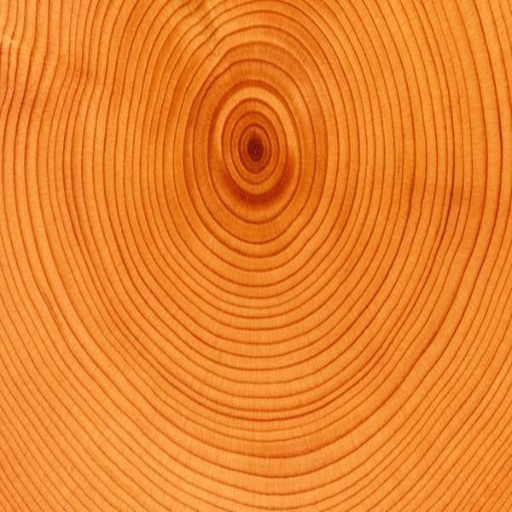 | 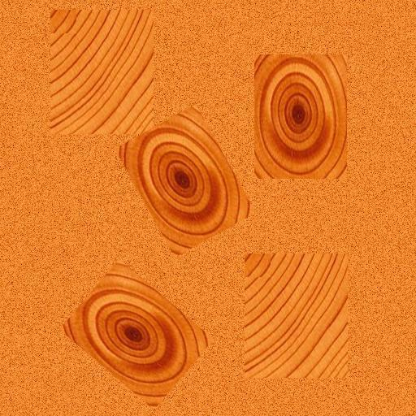 | 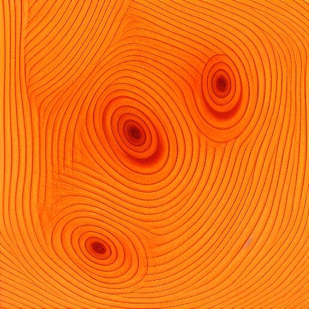 | P1=20, P2=15, <br />S1=20, S2=5.<br />augmentation:<br />6-1, 6-2, 6-3 |
| 203-1 | 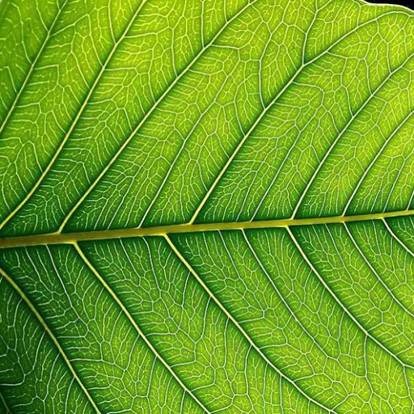 | 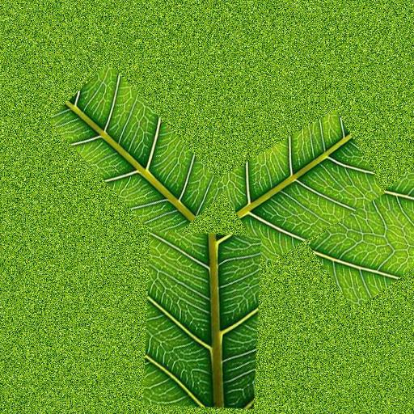 | 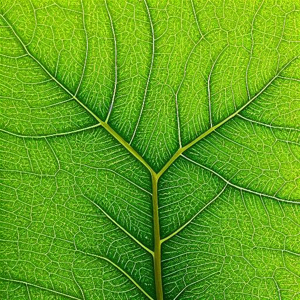 | P1=20, P2=5, <br />S1=20, S2=5.<br />augmentation:<br />203-1, 203-2, 203-3 |
| 3001-1 | 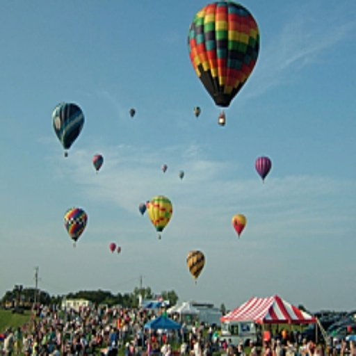 |  | 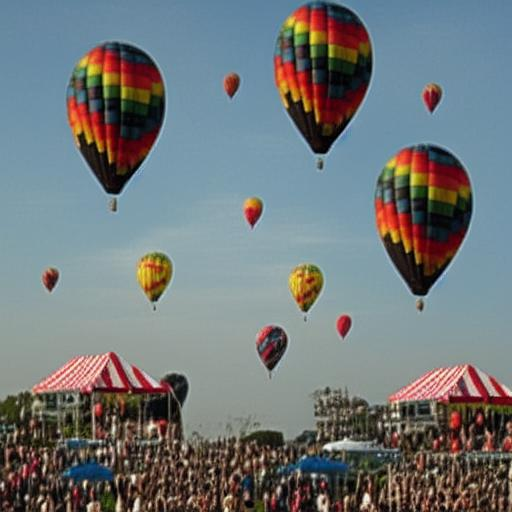 | P1=20, P2=5, <br />S1=20, S2=5.<br />no augmentation<br /> |
| 5001-1 | 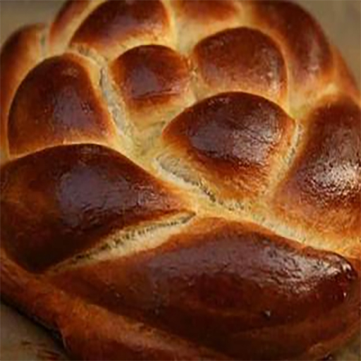 | 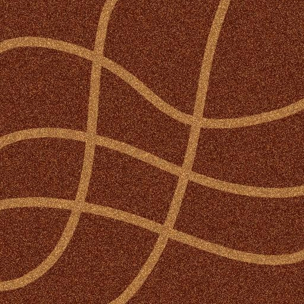 | 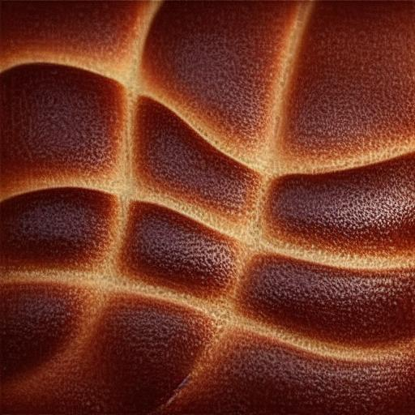 | P1=20, P2=5, <br />S1=20, S2=5.<br />no augmentation<br /> |

## Supplemental Material

[Link to Our Full Supplemental Material](https://xiaorongjun000.github.io/Self-Rectification-Supplementary/)

## Acknowledgements

The code is built upon [MasaCtrl](https://github.com/TencentARC/MasaCtrl). We sincerely thank for their great work.

## Cite

```
@inproceedings{zhou2024generating,
      title={Generating Non-Stationary Textures using Self-Rectification}, 
      author={Yang Zhou, Rongjun Xiao, Dani Lischinski, Daniel Cohen-Or, Hui Huang},
      booktitle={CVPR},
      year={2024}
}
```

